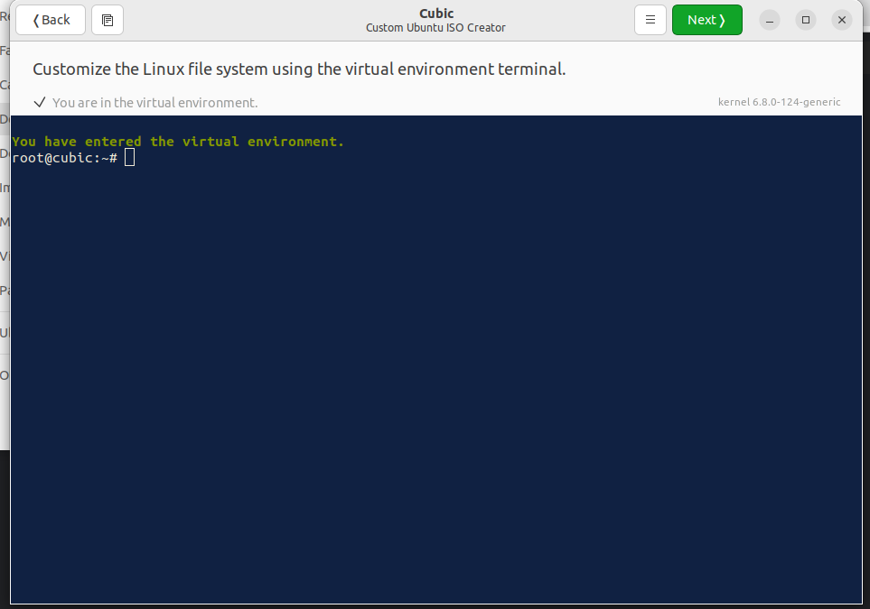
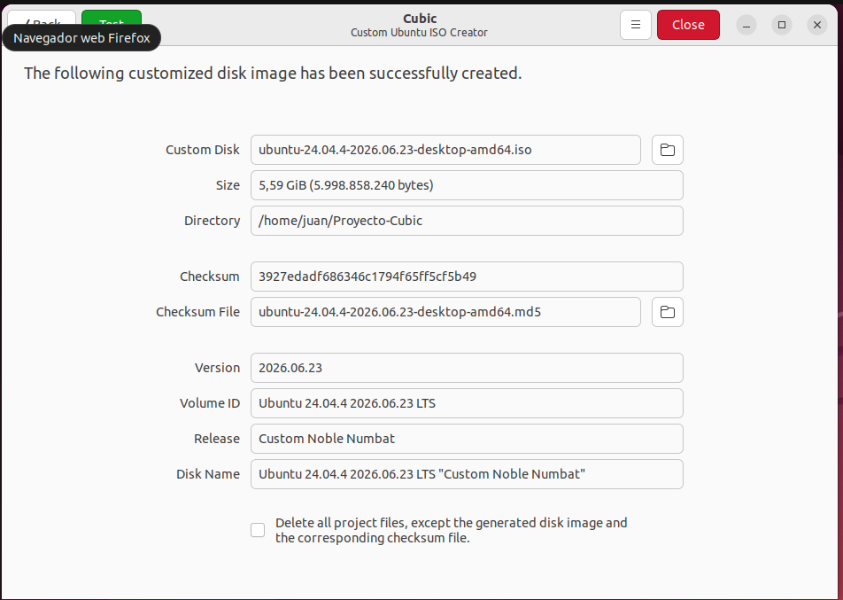

# Part 1 — Custom Linux Distribution with Cubic

## Base System Information
* **Base OS:** Ubuntu 24.04 LTS (Noble Numbat)
* **Desktop Environment:** GNOME Desktop
* **Target Architecture:** x86_64 (64-bit)
* **ISO Compression Algorithm:** XZ (Selected for optimal filesystem compression and minimal final package size as required by the global rubric)

---

## System Modifications & Architectural Justifications

To achieve a production-ready, customized environment, we executed an isolated virtual command-line environment (`Chroot`) inside Cubic and performed three major, persistent systemic modifications:

### 1. Preinstallation of a Complete Technical Development Environment (IDE)
* **Executed Command:**
  ```bash
  apt update && apt install -y neovim git build-essential tmux
  ```
* **Justification:** We embedded low-level compilation tooling (`GCC`, `GNU Make`) alongside version control (`Git`) and a highly extensible text editor (`Neovim`). This guarantees that the operating system is natively equipped for systems programming and kernel engineering tasks straight from the initial live-session bootstrap.

### 2. Default Browser Replacement for Enhanced Privacy and Open-Source Compliance
* **Executed Command:**
  ```bash
  apt purge -y firefox && apt install -y librewolf
  ```
* **Justification:** We removed the default telemetric browser in favor of **LibreWolf**. This is an independent, community-driven web browser focused on data privacy, tracking prevention, and telemetry elimination, ensuring the live user session adheres to strict open-source security guidelines.

### 3. Persistent User Profile Provisioning (`/etc/skel` Automation)
* **Executed Command:**
  ```bash
  mkdir -p /etc/skel/.config
  echo "echo '==========================================================='" >> /etc/skel/.bashrc
  echo "echo 'Welcome to the 64-bit Custom Distro engineered by:'" >> /etc/skel/.bashrc
  echo "echo '   Juan, Jose, Dheivid, and Luis'" >> /etc/skel/.bashrc
  echo "echo '==========================================================='" >> /etc/skel/.bashrc
  ```
* **Justification:** To fulfill the requirement for a permanent default customization, we manipulated the master skeleton directory (`/etc/skel`). Any new user accounts provisioned on this system will automatically inherit these shell configurations, ensuring persistent branding and execution parameters across clean sessions.

---

## Boot and Verification Evidence
Below are the visual anchors documenting the successful generation and hardware emulation of our custom ISO:

### 1. Live ISO Customization Interface via Cubic


### 2. QEMU Emulation and Custom `.bashrc` Greeting Banner Verification


