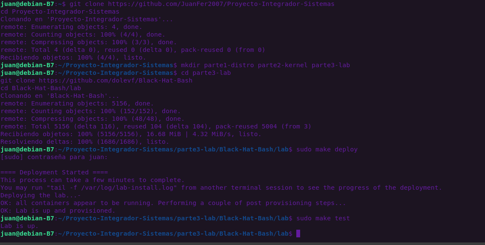

# Parte 3.A - Laboratorio de Hacking Desplegado

El laboratorio de seguridad de Black Hat Bash se ha levantado de forma exitosa en el entorno aislado de Debian.

## Evidencia de Funcionamiento

## Tabla de Arquitectura del Laboratorio

| Contenedor (Máquina) | Red Pública (IP) | Red Corporativa (IP) | Rol del Sistema |
| :--- | :--- | :--- | :--- |
| **p-web-01** | 172.16.10.10 | - | Servidor Web Público (Target principal) |
| **p-web-02** | 172.16.10.11 | - | Servidor Web de Soporte |
| **p-ftp-01** | 172.16.10.20 | - | Servidor FTP de la empresa |
| **c-db-01** | - | 10.1.0.10 | Base de datos interna (Aislada) |
| **c-mail-01** | - | 10.1.0.20 | Servidor de correo corporativo |

*Interfaces de red validadas:* `br_public` (Rango 172.16.10.0/24) y `br_corporate` (Rango 10.1.0.0/24).
