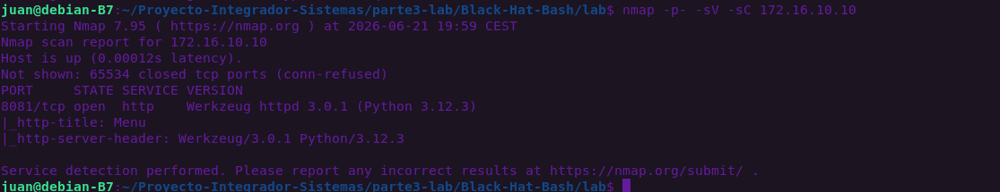

# Part 3.B - Advanced Network Reconnaissance & Security Interpretation

## 1. Executed Command & Methodology
A comprehensive and aggressive port and service discovery scan was conducted against the lab's public-facing boundary using **Nmap (Network Mapper)**. The objective was to map the external attack surface of the corporate network infrastructure.

```bash
nmap -p- -sV -sC 172.16.10.10
```

* **`-p-`**: Scans all 65,535 TCP ports to ensure no non-standard or obfuscated entry points are missed.
* **`-sV`**: Enables service version detection to determine the exact software daemon and build running on open ports.
* **`-sC`**: Runs default Nmap Scripting Engine (NSE) scripts to gather configuration metadata and discover initial vulnerabilities.

## 2. Technical Explanation of the Technique
* **What the technique does:** Port scanning actively sends crafted TCP packets (such as SYN flags) to every logical port on the target IP address. It analyzes the responses (SYN/ACK or RST) to determine whether a network service is actively listening (`open`) or blocking connections (`closed`).
* **Why it works:** Network daemons must expose logical ports to the network interface to accept connections from legitimate external clients. This exposure allows an auditor or attacker to probe the port, trigger response headers, and fingerprint the exact operating system and software stack without requiring prior authentication.

## 3. Obtained Information & Analytical Interpretation

The cryptographic probe and scan returned the following critical state:
* **Target Host Status:** Up (0.00012s latency).
* **Exposed Interface:** Port `8081/tcp` is explicitly in an `open` state.
* **Service Daemon:** `http` protocol.
* **Software Environment & Version:** `Werkzeug httpd 3.0.1` running on top of a `Python 3.12.3` runtime environment.
* **HTTP Metadata:** The automated NSE script extracted the HTML document header title: `"Menu"`.

### Strategic Risk Assessment & Interpretation:
The identification of **Werkzeug 3.0.1** indicates that the target application (`p-web-01`) is a Python-based web service utilizing lightweight development frameworks such as Flask or Django. 

In enterprise environments, exposing a Werkzeug development server directly to a public subnet (`172.16.10.0/24`) constitutes a critical security misconfiguration. If the framework's **Debug Mode** is enabled, an attacker can intentionally trigger an unhandled application exception to access the interactive web-based Python console. This console can be leveraged to execute arbitrary system commands (Remote Code Execution - RCE), compromise the underlying Docker container, and serve as a malicious pivoting point to attack the isolated backend corporate network (`10.1.0.0/24`).

## 4. Visual Evidence of the Attack Surface
The following screenshot verifies the execution parameters and the resulting network fingerprinting:


